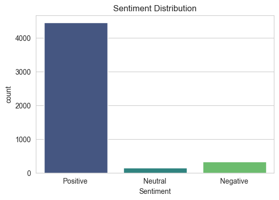
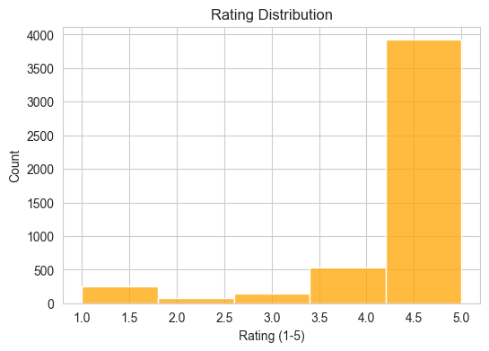
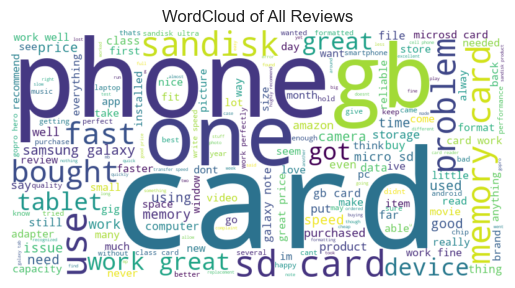
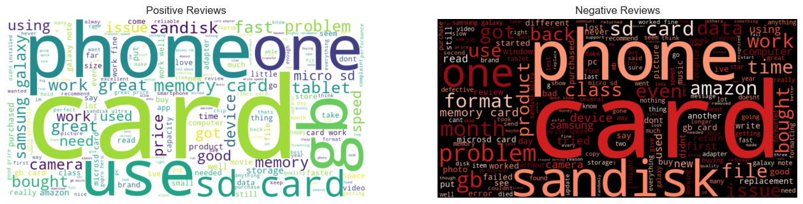
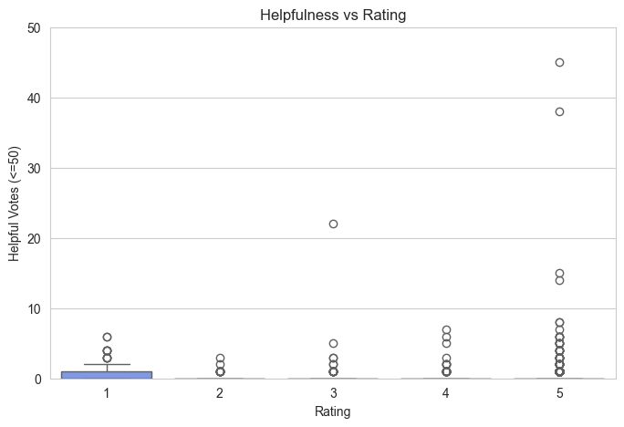
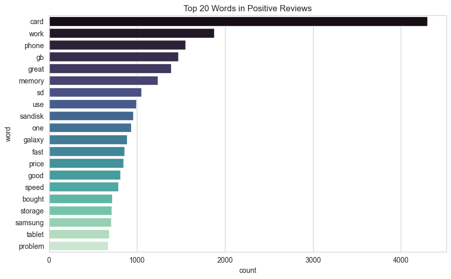
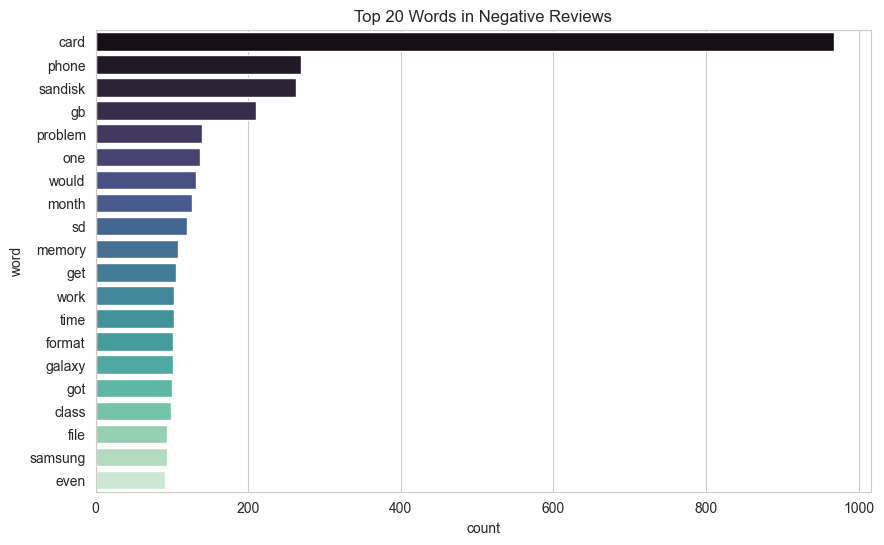
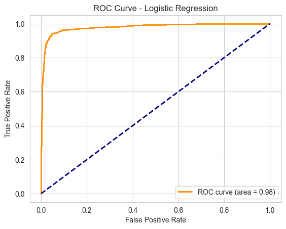
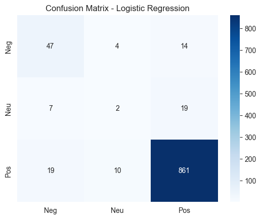

# Amazon Reviews Sentiment Analysis  

Este projeto realiza **análise de sentimentos em avaliações de produtos da Amazon**, utilizando técnicas de **Processamento de Linguagem Natural (NLP)** e modelos de **Machine Learning**.  

O objetivo é prever se uma review é **Positiva**, **Neutra** ou **Negativa**, a partir do texto e da nota atribuída pelo usuário.  

---

##  Estrutura do Projeto  

```bash
Amazon-Reviews-Sentiment/
│── data/
│ └── amazon.csv # Dataset original
│── notebooks/
│ └── analysis.ipynb # Análises exploratórias, visualizações, limpeza, modelos
│── models/
│ ├── sentiment_model.pkl # Modelo treinado salvo
│ └── tfidf_vectorizer.pkl # Vetorizador salvo
│── app.py # Aplicação Streamlit para demo
│── requirements.txt # Dependências do projeto
│── README.md # Documentação
```

---

##  Pré-processamento  

- **Limpeza de texto**:  
  - Conversão para minúsculo.  
  - Remoção de caracteres especiais.  
  - Remoção de stopwords.  
  - Lematização.  

- **Criação da variável `Sentiment`** a partir da nota (overall):  
  - ⭐⭐⭐⭐⭐ ou ⭐⭐⭐⭐ → **Positive**  
  - ⭐⭐⭐ → **Neutral**  
  - ⭐⭐ ou ⭐ → **Negative**  

---

##  Visualizações  

O projeto inclui várias análises exploratórias para entender melhor os dados:  

1. **Distribuição de sentimentos**  
     

2. **Distribuição das notas (ratings)**  
     

3. **WordCloud geral das reviews**  
     

4. **WordCloud comparando Positive vs Negative**  
     

5. **Helpful votes vs Rating (Boxplot)**  
     

6. **Top 20 palavras mais frequentes nas reviews positivas**  
     

7. **Top 20 palavras mais frequentes nas reviews negativas**  
     

Esses plots ajudam a entender padrões como:  
- Maioria das reviews são **positivas**.  
- Reviews negativas tendem a ser mais curtas.  
- Reviews mais úteis (helpful) geralmente aparecem em notas extremas (1 ou 5).  

---

## Modelos Treinados  

Foram comparados três algoritmos de Machine Learning:  

- **Logistic Regression**  
- **Naive Bayes (MultinomialNB)**  
- **Random Forest Classifier**  

Métricas avaliadas:  
- **Accuracy**  
- **F1-Macro (Cross-Validation)**  
- **Confusion Matrix**  

📌 O melhor desempenho foi obtido com **Logistic Regression**, que foi salvo para uso posterior.  

- **Acurácia**: ~92%  
- **Pontos fortes**: Lida bem com textos usando TF-IDF, é robusta contra desbalanceamento ao aplicar pesos por classe.  
- **Pontos fracos**: A classe **Neutra** é mais difícil de classificar devido à quantidade reduzida de exemplos.  

### Matriz de Confusão (Regressão Logística)  
 

### Curva ROC (Regressão Logística)  
  

---

##  Modelos Salvos  

Os melhores modelos e vetorizadores estão na pasta `models/`:  

- `sentiment_model.pkl` → Modelo Logistic Regression treinado  
- `tfidf_vectorizer.pkl` → Vetorizador TF-IDF usado na transformação dos textos  


---

## Requisitos  

Instale as dependências com:  

```bash
pip install -r requirements.txt
```
